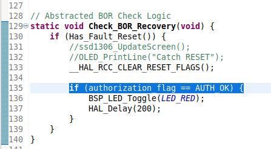
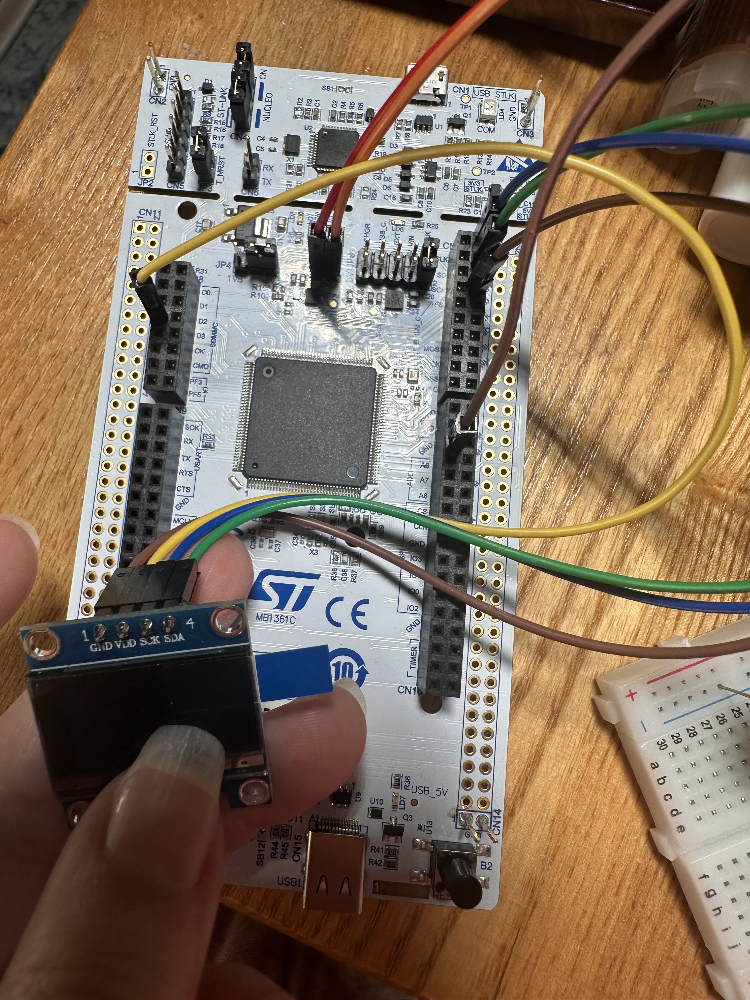
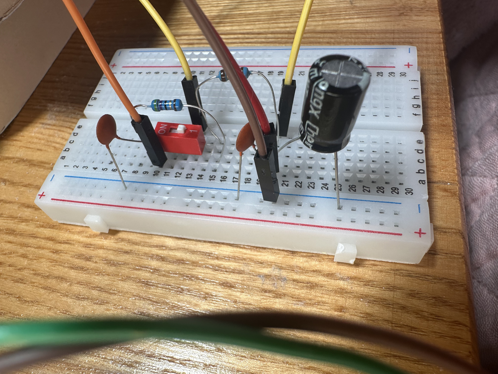

# PQC PDN Fault Dynamics & Defense Research

Research repository evaluating power delivery network (PDN) physical limits, capacitor decoupling trade-offs, and early-warning interrupt (PVD) zeroization strategies during Post-Quantum Cryptography (ML-KEM) execution on embedded platforms.

---

## Overview

Applying bulk and ceramic decoupling capacitors to protect microcontrollers against PQC-induced voltage sags can introduce a fault-masking "gray zone." In this state, degraded supply rails allow logic timing violations during matrix operations before hardware Brownout Reset (BOR) triggers, leaving cryptographic state exposed.

This project analyzes:
- **PDN Decoupling Interactions:** Bulk vs. ceramic capacitance hierarchy ($470\ \mu\text{F}$ bulk hold-up vs. $0.1\ \mu\text{F}$ clock-edge $di/dt$ filtering).
- **PVD Zeroization Handlers:** Software-initiated emergency reset (`PVD_PVM_IRQHandler`) vs. hardware $V_{\text{BOR}}$ trip delays.
- **Hardware/Software Mitigations:** Dual-layer boot-time reset checks (`RCC_FLAG_BORRST` / `RCC_FLAG_SFTRST`) and memory zeroization.

---

## Hardware & Toolchain
- **Target MCU:** STMicroelectronics NUCLEO-L552ZE-Q / STM32F4 series
- **Toolchain:** STM32CubeIDE, ST-Link V2/V3
- **Test Equipment:** Oscilloscope (transient $dV/dt$ measurement), Logic Analyzer, ChipWhisperer Lite/Nano

---

## Repository Structure
- `/src` - STM32 C source files, PVD interrupt routines, and zeroization logic => Root(main) code file is /src/Core/Src/main.c
- `/docs` - Experimental setup diagrams, power rail decay measurements, and technical notes

---

## Workstation Settings
- Nucleo-L552ZE-Q STM32 with TrustZone
- Breadboard
- Resistor of 47 Ohm and 10 Ohm connected in series to create load to initiate board BOR reset
- Electrolytic capacitor 470muF and 2 ceramic capacitors 0.1 muF to support board voltage during its sag and to support board CPU during current spikes (while electrolytic capacitor supports CPU)
- OLED TZT 0.95 display to show the steps (PQC steps and reset catch by voltage detector(PVD))

---

## Hardware Countermeasure Trade-offs & The "Gray Zone" Vulnerability

To smooth voltage sags on the NUCLEO-L552ZE-Q (STM32L552) and nRF5340 during high-transient post-quantum workloads (e.g., ML-KEM keypair generation and encapsulation), several power-distribution and system-level mitigations can be deployed: dynamic frequency scaling, clock gating, workload iteration restructuring, dynamic power management, and board-level decoupling networks.

---

### 1. Decoupling Observations & The "Gray Zone" Effect
During physical hardware evaluation using passive capacitance strengthening, two distinct execution outcomes were observed under heavy ML-KEM transient currents:

1. **Complete Voltage Stabilization:** Sufficient charge delivery prevents board reset entirely during cryptographic execution.
2. **The "Gray Zone" Fault-Masking Window:** The board completes the full execution of the cryptographic operation under severely degraded power rail conditions, only to suffer a delayed reset (i.e., `main()` re-executes from scratch immediately after completion).

---

### 2. Physical & Security Implications of Delayed Resets
The "gray zone" presents a critical hardware security paradox:

* **Board Configuration:** A 470 µF electrolytic bulk capacitor restores macro supply voltage while a 100 nF (104) ceramic capacitor filters high-frequency transient di/dt switching spikes.
* **Failure Mechanism:** The decoupling network holds the rail voltage *just above* the hardware Brownout Reset (BOR) threshold long enough for execution to finish, but *below* nominal operating levels required for timing margins.
* **Exploitation Window:** Because execution completes on an unstable power rail instead of halting instantly, register states and SRAM remain populated with un-zeroed ML-KEM secret material (e.g., polynomial coefficients, intermediate secrets). This window opens the system to instruction skipping, register corruption, and memory extraction prior to the delayed reset.

> **Analogy:** A traveler carrying a wallet through a forest is kicked hard by an attacker. Instead of remaining fully alert or falling completely unconscious, the traveler enters a dizzy, half-conscious state—long enough for the attacker to easily grab the exposed wallet before the traveler collapses.

---

### 3. Firmware Mitigation: Early-Warning PVD Zeroization
To prevent delayed-reset exploitation, hardware capacitance must be paired with active voltage monitoring via the internal **Programmable Voltage Detector (PVD)**:

```text
                  Voltage Rail Sag Trend
V_NOM (3.3V) ---------------------------------------
                \  
                 \  <-- PVD Level 4 Interrupt Triggered (~2.56V)
V_PVD (2.56V) ----\---------------------------------
                   \   [ ISR: Immediate SRAM Zeroization & Execution Halt ]
                    \
V_BOR         -------\------------------------------ (Hardware Reset Line)

```

To check zeroization result => look at this function in "main.c", while debug after voltage sag because of resistors load and PQC execution at the same time, the PVD_PVM_IRQHandler function will work out and later will be called reset function Check_BOR_Recovery where authorization_flag data will be zeroed but if to do not zero it in PVD handler, then it would hold value after BOR reset(voltage sag):

<p align="center">
  
  <br>
  <em>Figure: Live PVD voltage sag detection and zeroization sequence.</em>
</p>

> **Note:** Current Zeroization works when PVD works, PVD works for level 4 voltage sag, for some cases it still need additional defensive techniques. 

Here is code of the function(in "src/Core/Src/main.c" file) that catches the voltage sag of level 4:
```c
void PVD_PVM_IRQHandler(void) {
	BSP_LED_Toggle(LED_BLUE);
	OLED_PrintLine("Catch RESET");

	if (__HAL_PWR_PVD_EXTI_GET_FLAG()) {
		authorization_flag = 0x00000000U;

		// 3. Memory barrier to ensure SRAM write completes
		__DSB();
		__ISB();

		// 4. Clear flag & trigger immediate software reset
		__HAL_PWR_PVD_EXTI_CLEAR_FLAG();
		NVIC_SystemReset();
	}
}
```

1. Active Detection: The PVD is configured to Level 4 in function void System_PVD_Init(void) of "main.c" file (threshold set to approximately 2.556 V).
2. In PVD_PVM_IRQHandler() function the execution is interrupted: when transient current causes V_DD to sag across the 2.556 V threshold, PVD_PVM_IRQHandler fires before the rail reaches critical logic corruption levels or BOR thresholds.
3. In PVD_PVM_IRQHandler() is made emergency zeroization: the ISR immediately clears sensitive memory buffers containing ephemeral keys, halts the peripheral execution pipelines, and forces a controlled software state reset.

> **Analogy Continuation:** As soon as the attacker kicks the traveler, the wallet instantly disintegrates into dust. By the time the traveler drops, there is nothing for the attacker to take.

---

### 4. Device Physics: CMOS Propagation Delays Under Sagged Rails

The physical root cause of the "gray zone" lies in CMOS transistor switching dynamics:
Propagation Delay Inflation: At a nominal core frequency of 80 MHz, the system clock period is 12.5 ns. Under V_DD sag, gate drive current I_ON drops, increasing propagation delay t_prop (e.g., extending a critical path delay from 10 ns up to 15 ns).

Timing Violations: Because the hardware clock tree continues to toggle every 12.5 ns, signals fail to setup at flip-flop inputs before the next active clock edge (t_setup violation).

State Corruption: Transient logic states are latched incorrectly during polynomial arithmetic, causing arithmetic errors, corrupted intermediate states, or skipped conditional branch instructions while avoiding immediate hardware reset thresholds.

---

## Connections
### Nucleo board and Display
- connect display VDD for power source to Nucleo board 3V3 on CN8 (use yellow female-male DUPONT wire)
- connect display GND to Nucleo board GND on CN7 (female header from the right 4th row, use brown female-male DUPONT wire)
- connect display SCK clock pin (to sync with board clock) to SCL on CN7 (1st row, female header on the right, use blue female-male DUPONT wire)
- connect display SDA data pin to Nucleo board's SDA (2nd row, right, use green female-male DUPONT wire)
<p align="center">
  
  <br>
  <em>Figure: OLED Display TZT pins, connected Dupont wires from the pins to Nucleo board </em>
</p>

---

### Nucleo board and Breadboard
- Nucleo's IDD pin 1 connect to 10a (use orange female-male DUPONT wire)
- Nucleo's IDD pin 2 connect to 20a (use red female-male DUPONT wire)
- Nucleo's GND on CN7 connect to blue line of breadboard any row, for e.g. 20 or 21 (use brown male-male DUPONT wire)

---

### Breadboard
- Add resistor 47 Ohm to 10b and 15b to increase voltage sag to get into BOR reset
- Add resistor 10 Ohm to 10d and 20d to increase voltage sag to get into BOR reset
- Add switcher to 10c and 13c to open and close the path of resistors that increase voltage sag (default state of resistor "on" i.e. a path without resistors is open)
- Add a yellow male-male DUPONT wire from 13e to 20e (we need it because the switcher is too small to sit from 10 row to 20 row to set the path made of resistors so we use dupont wire to enable the path when the switcher will be switch to "off")
- Add electrolytic capacitor 470 muF: anode(long leg to 20th row free cell) and cathode(short leg) to breadboard GND(blue line)
- Add the first ceramic 0.1 muF: anode to another free cell on 20th row and cathode to breadboard GND(blue line)
- Add the second ceramic 0.1 muF: anode to 10th row free cell and cathode to breadboard GND(blue line) 

<p align="center">
  
  <br>
  <em>Figure: Breadboard with connected Nucleo board, resistors of 47 Ohm and 10 Ohm in series, 1 electrolytic and 2 ceramic capacitors, switcher</em>
</p>

